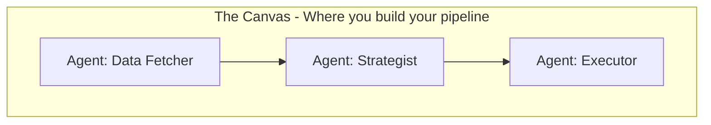
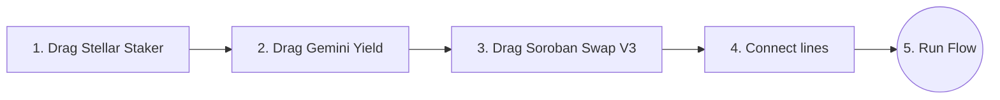
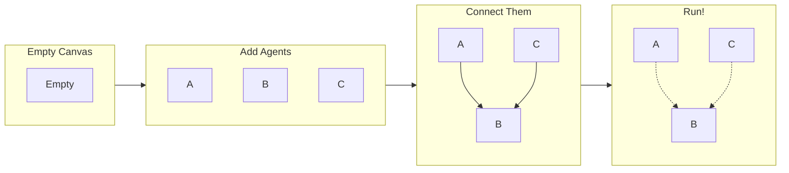

# How AgentFlow Works — A Complete Guide

> Written for anyone — whether you're 15, 18, or 50. No confusing jargon. Lots of examples. If you can use Instagram, you can understand this.

---

## Table of Contents

1. [What is AgentFlow?](#1-what-is-agentflow)
2. [The Problem It Solves (With Real Scenarios)](#2-the-problem-it-solves)
3. [The Big Idea — Agents](#3-the-big-idea--agents)
4. [The Canvas — Where Everything Happens](#4-the-canvas--where-everything-happens)
5. [How to Build a Workflow (Step by Step)](#5-how-to-build-a-workflow-step-by-step)
6. [Three Ways to Use AgentFlow](#6-three-ways-to-use-agentflow)
7. [Real-World Scenarios](#7-real-world-scenarios)
8. [Agent Categories Explained](#8-agent-categories-explained)
9. [The Full Agent List](#9-the-full-agent-list)
10. [How Agents Talk to Each Other (Output Chaining)](#10-how-agents-talk-to-each-other)
11. [Agent X — Your AI Co-Pilot](#11-agent-x--your-ai-co-pilot)
12. [For Developers and Other AI Agents](#12-for-developers-and-other-ai-agents)
13. [Glossary](#13-glossary)
14. [FAQ](#14-faq)

---

## 1. What is AgentFlow?

Imagine you have a team of little robot helpers. Each robot is really good at ONE thing:

- One robot checks crypto prices 
- One robot stakes your XLM to earn interest 
- One robot swaps tokens on a DEX 
- One robot thinks about the best strategy using AI 
- One robot executes transactions on the blockchain 

**AgentFlow lets you drag these robots onto a canvas, connect them together, and hit "Run" — and they all work together automatically, passing information from one to the next.**

Think of it like building with LEGO blocks, but instead of building a house, you're building an automated crypto workflow.



---

## 2. The Problem It Solves

### The Old Way (Hard)

Let's say you want to do something simple in crypto — like "take my XLM, earn interest on it, and when the interest grows, swap it to USDC."

Without AgentFlow, here's what you'd have to do:

```
Step 1: Go to Stellar Staker's website, connect wallet, stake XLM          (10 minutes)
Step 2: Wait for interest to build up                             (days/weeks)
Step 3: Go to a price oracle website, check XLM price             (5 minutes)
Step 4: Open a DEX like Soroban Swap, set up the swap                  (10 minutes)
Step 5: Review gas fees, approve tokens, confirm swap              (10 minutes)
Step 6: Check if the swap went through                             (5 minutes)

Total: 40+ minutes of clicking around on 4 different websites
       And you have to do this EVERY TIME
```

### The AgentFlow Way (Easy)



Total: Under 2 minutes. And it runs automatically every time.

### Here's a Picture of the Difference

```mermaid
flowchart TD
    User([You doing everything manually])
    Stellar Staker[Stellar Staker Website]
    Price[Price Oracle Website]
    Soroban Swap[Soroban Swap Website]
    
    User -- Connections, Clicks, Copy/Paste --> Stellar Staker
    User -- Check prices --> Price
    User -- Execute Swaps --> Soroban Swap
```

---

## 3. The Big Idea — Agents

An **agent** is a small program that does one specific job. That's it. Nothing more complicated.

Here are some examples:

| Agent Name           | What It Does                                         | Real-World Comparison                                |
| -------------------- | ---------------------------------------------------- | ---------------------------------------------------- |
| **Asset Pricer Oracle** | Checks the current price of XLM, BTC, etc.           | Like checking the stock ticker on your phone         |
| **Stellar Staker**      | Stakes your XLM to earn interest                     | Like putting money in a savings account              |
| **Soroban Swap V3 Swap**  | Swaps one token for another                          | Like exchanging dollars for euros at the airport     |
| **Gemini Reasoner**  | AI that thinks about your data privately             | Like asking a financial advisor for advice           |
| **Federation Resolver**     | Turns names like "astrobob*stellar.org" into wallet addresses | Like looking up someone's phone number by their name |
| **Bankr Wallet**     | Checks your wallet balance                           | Like checking your bank account balance              |
| **Soroban TX Executor** | Sends transactions on Soroban chain                     | Like hitting "Send" on a bank transfer               |

### Why "Agents" and Not Just "Apps"?

The word "agent" means the program can **act on its own**. You tell it what to do once, and it does it. You don't have to babysit it.

Also, agents can **talk to each other**. When the Price Oracle finishes checking the price, it passes that price to the next agent in line. This is called **output chaining** — more on that below.

---

## 4. The Canvas — Where Everything Happens

When you open AgentFlow, you see a big dark canvas (like a whiteboard). Here's what's on the screen:

```
┌─────────────────────────────────────────────────────────────────────┐
│ ┌─ TOOLBAR ──────────────────────────────────────────────────────┐ │
│ │  AgentFlow  │  Flow Name  │        │ Run Flow │ Chat │ Logs   │ │
│ └────────────────────────────────────────────────────────────────┘ │
│                                                                     │
│ ┌─ SIDEBAR ─┐  ┌─ CANVAS ──────────────────────────────────────┐  │
│ │            │  │                                                │  │
│ │ Search...  │  │    ┌──────────┐       ┌──────────┐           │  │
│ │            │  │    │  Stellar Staker    │──────▶│  Gemini  │           │  │
│ │ ○ All      │  │    │  Staker  │       │  AI      │           │  │
│ │ ○ DeFi     │  │    └──────────┘       └────┬─────┘           │  │
│ │ ○ AI       │  │                            │                  │  │
│ │ ○ Oracle   │  │                            ▼                  │  │
│ │ ○ Identity │  │                     ┌──────────┐              │  │
│ │ ○ Payments │  │                     │ Soroban Swap  │              │  │
│ │            │  │                     │  Swap    │              │  │
│ │ ┌────────┐ │  │                     └──────────┘              │  │
│ │ │ Agent  │ │  │                                                │  │
│ │ │ Cards  │ │  │                                                │  │
│ │ │ Here   │ │  │                                                │  │
│ │ └────────┘ │  │                                                │  │
│ └────────────┘  └────────────────────────────────────────────────┘  │
│                                                                     │
│ ┌─ LOG PANEL ────────────────────────────────────────────────────┐ │
│ │  Step 1: Stellar Staker — Completed in 2400ms — APR 3.43%       │ │
│ │  Step 2: Gemini AI — Completed in 8500ms — SWAP_TO_USDC      │ │
│ │  Step 3: Soroban Swap Swap — Completed in 3200ms — 2.09 USDC     │ │
│ └────────────────────────────────────────────────────────────────┘ │
└─────────────────────────────────────────────────────────────────────┘
```

### Parts of the Screen

| Part                                  | What It Is              | What You Do With It                                    |
| ------------------------------------- | ----------------------- | ------------------------------------------------------ |
| **Toolbar** (top)                     | The menu bar            | Name your flow, run it, open chat, see logs            |
| **Sidebar** (left)                    | List of all 40+ agents  | Search, filter by category, drag agents onto canvas    |
| **Canvas** (center)                   | The big workspace       | Drag agents around, draw lines between them            |
| **Log Panel** (bottom)                | Real-time execution log | Watch your flow run step by step with live results     |
| **Inspector** (right, opens on click) | Agent settings          | Click any agent on canvas to see and edit its settings |
| **Agent X Chat** (bottom-right)       | AI chat assistant       | Talk to your agents in plain English                   |

---

## 5. How to Build a Workflow (Step by Step)

### Method 1: Drag and Drop (Visual)

**Step 1: Find the agent you want**
- Look at the sidebar on the left
- Use the search bar to find agents by name (e.g., type "Stellar Staker")
- Or click a category filter (DeFi, AI, Oracle, etc.)

**Step 2: Drag it onto the canvas**
- Click and hold an agent card in the sidebar
- Drag it to the canvas area
- Let go — the agent node appears!

**Step 3: Connect agents**
- Hover over an agent node — you'll see small dots (called "handles") on the edges
- Click a handle on Agent A and drag to a handle on Agent B
- A line (edge) appears connecting them — this means "Agent A's output goes to Agent B"

**Step 4: Set parameters (optional)**
- Click on any agent node to open the Inspector panel
- Change settings like wallet address, amount, token, etc.

**Step 5: Run it!**
- Click the **"Run Flow"** button in the toolbar
- A modal pops up showing the execution order
- Enter your wallet address and amount (optional)
- Click **"Execute Pipeline"**
- Watch the Log Panel — each agent lights up green as it completes



### Method 2: Ask Agent X (Chat)

Instead of dragging and dropping, you can just talk to Agent X (the AI assistant):

**Step 1:** Click the purple chat bubble icon in the toolbar

**Step 2:** Type something like:
> "Build me a DeFi yield pipeline with Stellar Staker staking, Gemini AI strategy, and Soroban Swap swap"

**Step 3:** Watch the magic happen — Agent X will:
- Clear the canvas
- Add each agent one by one (you'll see them appear in real time!)
- Draw the connections between them
- Tell you when it's ready

**Step 4:** Say "Run the pipeline" in the chat, or click Run Flow

```
 You type:  "Build me a DeFi pipeline with Stellar Staker and Soroban Swap"
                              │
                              ▼
 Agent X:   "I'll build that for you!"
                              │
             ┌────────────────┼─────────────────┐
             ▼                ▼                  ▼
    Adds Stellar Staker   Adds Gemini AI    Adds Soroban Swap Swap
    to canvas (0.5s)   to canvas (0.5s)  to canvas (0.5s)
             │                │                  │
             └────────────────┼─────────────────┘
                              ▼
                   Draws connections
                              │
                              ▼
               "Pipeline ready! Say 'run'"
```

---

## 6. Three Ways to Use AgentFlow

AgentFlow gives you **three different ways** to interact with it. Use whichever feels most natural:

### Way 1: Canvas (Visual — for humans who like to see things)

- Drag and drop agents
- Draw connections with your mouse
- Click to configure settings
- Best for: **Building new workflows, visual learners, first-time users**

### Way 2: Agent X Chat (Talk — for humans who like to type)

- Open the chat panel (purple icon in toolbar)
- Type commands in plain English
- Agent X builds workflows, runs agents, answers questions
- Best for: **Quick tasks, building workflows fast, running single agents**

**Example chat commands:**
| What You Type                   | What Happens                                            |
| ------------------------------- | ------------------------------------------------------- |
| "Build me a DeFi pipeline"      | Agent X creates a full workflow on the canvas           |
| "Check the price of XLM"        | Runs the Asset Pricer Oracle agent and shows you the price |
| "Swap 0.001 XLM to USDC"        | Runs Soroban Swap V3 Swap with a real quote                  |
| "Run the pipeline"              | Executes whatever is on the canvas                      |
| "Add a price oracle to my flow" | Adds a Asset Pricer Oracle to the existing canvas          |
| "What agents do you have?"      | Lists all available agents by category                  |

### Way 3: API (Code — for developers and other AI agents)

- Send HTTP requests to AgentFlow's API endpoints
- Run individual agents or full pipelines programmatically
- Other AI agents can call AgentFlow as a tool
- Best for: **Developers, bots, automated systems, other AI agents**

```
Which Way Should I Use?

                    ┌───────────────────┐
                    │  Are you a human? │
                    └────────┬──────────┘
                             │
                    ┌────────▼──────────┐
              ┌─ No │  Are you an AI    │ Yes ─┐
              │     │  agent or bot?    │      │
              │     └───────────────────┘      │
              │                                │
              ▼                                ▼
    ┌──────────────────┐            ┌──────────────────┐
    │  Use the API     │            │ Do you like       │
    │  (Way 3)         │            │ clicking or       │
    │                  │            │ typing?           │
    └──────────────────┘            └────────┬─────────┘
                                             │
                               ┌─────────────┼──────────────┐
                               ▼                             ▼
                    ┌──────────────────┐          ┌──────────────────┐
                    │  Clicking?       │          │  Typing?         │
                    │  Use the Canvas  │          │  Use Agent X     │
                    │  (Way 1)         │          │  Chat (Way 2)    │
                    └──────────────────┘          └──────────────────┘
```

---

## 7. Real-World Scenarios

Here are real things you can do with AgentFlow, explained like stories:

---

### Scenario 1: "I Want to Earn Interest on My XLM"

**The story:** You have some XLM sitting in your wallet doing nothing. You want it to earn interest, like a savings account. But you also want an AI to watch over it and tell you what's happening.

**The pipeline:**

```
  ┌──────────────┐       ┌──────────────┐       ┌──────────────┐
  │ Stellar Staker  │──────▶│ Stellar Staker Vault   │──────▶│ Gemini Yield │
  │              │       │ Monitor      │       │ Strategist   │
  │ Stakes your  │       │ Watches your │       │ AI thinks    │
  │ XLM in Stellar Staker  │       │ stXLM balance│       │ about what   │
  │ to earn stXLM│       │ and reports  │       │ to do next   │
  └──────────────┘       └──────────────┘       └──────────────┘

  Step 1: Stellar Staker stakes 0.1 XLM → gets stXLM earning 3.43% APR
  Step 2: Vault Monitor reads your balance → "You have 0.1003 stXLM ($213.64)"
  Step 3: Gemini AI says → "HOLD — yield is growing steadily, no action needed"
```

**How to do it:**
- Chat method: Type "Build me a Stellar Staker yield monitoring pipeline"
- Canvas method: Drag Stellar Staker → Stellar Staker Vault Monitor → Gemini Yield Strategist, connect them

---

### Scenario 2: "I Want to Swap XLM to USDC But I Want AI to Decide If It's a Good Time"

**The story:** You want to convert some XLM to USDC (a stablecoin pegged to the US dollar). But you don't want to do it at a bad time — maybe gas fees are too high, or the price is dipping. You want an AI to look at everything and decide: should I swap NOW, WAIT, or SKIP it?

**The pipeline:**

```
  ┌──────────────┐       ┌──────────────┐       ┌──────────────┐
  │ Asset Pricer    │──────▶│ Soroban Swap      │──────▶│ Soroban Swap      │
  │ Oracle       │       │ Strategy     │       │ V3 Swap      │
  │              │       │ Advisor      │       │              │
  │ Gets the     │       │ Gemini AI    │       │ Actually     │
  │ current XLM  │       │ decides:     │       │ does the     │
  │ price        │       │ EXECUTE,     │       │ swap on-     │
  │              │       │ WAIT, or     │       │ chain        │
  │              │       │ SKIP         │       │              │
  └──────────────┘       └──────────────┘       └──────────────┘

  Step 1: Asset Pricer says → "XLM/USD = $2,146.12"
  Step 2: Strategy AI says → "EXECUTE — gas is low, price is stable, good time to swap"
  Step 3: Soroban Swap quotes → "0.001 XLM = 2.09 USDC, transaction ready to sign"
```

**How to do it:**
- Chat method: Type "Create a smart swap pipeline with price check, AI strategy, and Soroban Swap"
- Canvas method: Drag Asset Pricer Oracle → Soroban Swap Strategy Advisor → Soroban Swap V3 Swap

---

### Scenario 3: "I Want to Check if Someone's Identity is Legit Before Sending Them Money"

**The story:** You're building a payment system. Before you send money to someone, you want to make sure they're a real person (identity check) and that their wallet address is correct (Federation lookup). Then you send the payment on Celo (a cheap blockchain).

**The pipeline:**

```
  ┌──────────────┐       ┌──────────────┐       ┌──────────────┐
  │ Federation Resolver │──────▶│ SELF         │──────▶│ Celo Stable  │
  │              │       │ Identity     │       │ Transfer     │
  │ Turns        │       │              │       │              │
  │ "bob.eth"    │       │ Checks if    │       │ Sends $5     │
  │ into a real  │       │ the person   │       │ cUSD to the  │
  │ wallet       │       │ is verified  │       │ verified     │
  │ address      │       │ (age, nation │       │ address      │
  │              │       │ ality, etc.) │       │              │
  └──────────────┘       └──────────────┘       └──────────────┘

  Step 1: Federation Resolver → "bob.eth = 0x1234...abcd"
  Step 2: SELF Identity → "Verified: age_over_18 , nationality "
  Step 3: Celo Transfer → "Sent 5.00 cUSD to 0x1234...abcd "
```

---

### Scenario 4: "I'm a DAO Member and I Want Automated Voting + Grant Allocation"

**The story:** You're part of a DAO (a community-run organization). You want to automatically check what proposals are being voted on, use AI to analyze them, and allocate grants to the best projects.

**The pipeline:**

```
  ┌──────────────┐       ┌──────────────┐       ┌──────────────┐
  │ Snapshot     │──────▶│ Gemini       │──────▶│ Octant Grant │
  │ Voter        │       │ Reasoner     │       │ Allocator    │
  │              │       │              │       │              │
  │ Fetches      │       │ AI analyzes  │       │ Distributes  │
  │ active DAO   │       │ each proposal│       │ grants based │
  │ proposals    │       │ and scores   │       │ on AI scores │
  │              │       │ them         │       │              │
  └──────────────┘       └──────────────┘       └──────────────┘

  Step 1: Snapshot finds 3 active proposals on governance
  Step 2: Gemini AI analyzes → "Proposal A: Strong, Proposal B: Weak, Proposal C: Medium"
  Step 3: Octant allocates → "Grant weights: A=50%, B=10%, C=40%"
```

---

### Scenario 5: "I'm an AI Agent and I Want to Use AgentFlow as a Tool"

**The story:** You're an AI agent (like a GPT or Claude). You want to check a crypto price, do a swap, or run a full pipeline. You talk to AgentFlow's API.

```
  ┌──────────────────────────────────────────────┐
  │              Your AI Agent                    │
  │                                               │
  │  "I need to check the XLM price and maybe    │
  │   do a swap if it's above $2000"             │
  │                                               │
  └──────────────────┬────────────────────────────┘
                     │
                     │  POST /api/chat
                     │  { "message": "Get XLM price" }
                     │
                     ▼
  ┌──────────────────────────────────────────────┐
  │              AgentFlow                        │
  │                                               │
  │  Agent X understands your intent             │
  │  → dispatches Asset Pricer Oracle               │
  │  → returns: { price: $2,146.12 }            │
  │                                               │
  └──────────────────┬────────────────────────────┘
                     │
                     │  Response JSON
                     │
                     ▼
  ┌──────────────────────────────────────────────┐
  │              Your AI Agent                    │
  │                                               │
  │  "Price is $2,146 — above $2000!"            │
  │  → calls POST /api/chat                      │
  │  → "Swap 0.001 XLM to USDC"                 │
  │  → gets back a ready-to-sign transaction     │
  │                                               │
  └──────────────────────────────────────────────┘
```

---

## 8. Agent Categories Explained

All 40+ agents are organized into categories. Here's what each category means:

```
  CATEGORIES AT A GLANCE

  ┌─────────────┬─────────────┬─────────────┬─────────────┐
  │    DeFi   │    AI     │    Oracle  │    Core   │
  │ Swap, stake │ Think, plan │ Get data    │ Orchestrate │
  │ lend, earn  │ strategize  │ prices,     │ route, and  │
  │             │ privately   │ feeds       │ compose     │
  ├─────────────┼─────────────┼─────────────┼─────────────┤
  │    Identity│   Auth    │   Trust    │   Chain   │
  │ Federation names,  │ MetaMask    │ Verify,     │ Send        │
  │ SELF verify │ delegation, │ ERC-8004,   │ transactions│
  │             │ Lit signing │ EigenLayer  │ on Soroban     │
  ├─────────────┼─────────────┼─────────────┼─────────────┤
  │   Governance│   Payments│  ️ NFT     │             │
  │ Snapshot,   │ Bankr,      │ SuperRare   │             │
  │ Octant,     │ MoonPay,    │ art and     │             │
  │ Markee      │ Celo        │ bidding     │             │
  └─────────────┴─────────────┴─────────────┴─────────────┘
```

| Category       | What It Means                                               | Example Agents                                                                |
| -------------- | ----------------------------------------------------------- | ----------------------------------------------------------------------------- |
| **Core**       | The backbone — manages how agents run and work together     | Orchestrator, Super Agent Composer                                            |
| **DeFi**       | Decentralized Finance — swapping, staking, lending, earning | Soroban Swap Swap, Stellar Staker, Zyfai Solver, bond.credit                          |
| **AI**         | Artificial Intelligence — thinking, planning, strategizing  | Gemini Reasoner, Gemini Yield Strategist, Soroban Swap Strategy Advisor, Olas Mech |
| **Oracle**     | Data feeds — getting real-time info from the real world     | Asset Pricer Price Oracle                                                        |
| **Identity**   | Who are you? — names, addresses, verification               | Federation Resolver, SELF Identity, Federation Agent Name                                   |
| **Auth**       | Permissions — who can do what                               | MetaMask Delegation, Lit Access Control, Lit PKP Signer                       |
| **Trust**      | Can I trust this? — verification and security               | ERC-8004 Verifier, EigenCloud Exec, Olas Service, Arkhai Verifier             |
| **Chain**      | Blockchain execution — sending transactions                 | Soroban TX Executor                                                              |
| **Governance** | Community decisions — voting, grants, campaigns             | Snapshot Voter, Octant Impact, Octant Allocator, Markee Campaign              |
| **Payments**   | Money movement — wallets, swaps, transfers                  | Bankr Wallet, MoonPay Bridge, Celo Transfer                                   |
| **NFT**        | Digital art and collectibles                                | SuperRare Lister, SuperRare Bidder                                            |

---

## 9. The Full Agent List

Here's every agent in AgentFlow, with a one-line description of what it does:

### Core
| Agent                | Sponsor   | What It Does                                            |
| -------------------- | --------- | ------------------------------------------------------- |
| Orchestrator         | AgentFlow | Coordinates execution order and message passing between agents |

### Chain
| Agent               | Sponsor   | What It Does                                                              |
| ------------------- | --------- | ------------------------------------------------------------------------- |
| Horizon Reader      | Stellar   | Reads account balances and recent operations from Stellar Horizon         |

### Identity
| Agent               | Sponsor   | What It Does                                                              |
| ------------------- | --------- | ------------------------------------------------------------------------- |
| Federation Resolver | Stellar   | Resolves federation addresses like "astrobob*stellar.org"                  |

### Oracle
| Agent               | Sponsor   | What It Does                                                              |
| ------------------- | --------- | ------------------------------------------------------------------------- |
| Asset Pricer        | Stellar   | Fetches Stellar asset prices using public market APIs                     |

### AI
| Agent               | Sponsor   | What It Does                                                              |
| ------------------- | --------- | ------------------------------------------------------------------------- |
| Gemini Reasoner     | Google    | Analyzes data and advises based on custom prompts                         |

### DeFi
| Agent               | Sponsor   | What It Does                                                              |
| ------------------- | --------- | ------------------------------------------------------------------------- |
| Soroban Swapper     | Soroban   | Executes token swaps using Soroban DeFi protocols                         |

### Payments
| Agent               | Sponsor   | What It Does                                                              |
| ------------------- | --------- | ------------------------------------------------------------------------- |
| Payment Executor    | Stellar   | Drafts transaction XDRs out of intents to pay                             |


## 10. How Agents Talk to Each Other

This is one of the coolest parts of AgentFlow. When you connect agents in a pipeline, the **output of one agent automatically becomes the input of the next agent.** This is called **output chaining.**

### How It Works (Simple Version)

```
  Agent A runs first
       │
       │  "Hey Agent B, here's what I found: XLM = $2,146"
       │
       ▼
  Agent B receives that info and uses it
       │
       │  "Thanks! Soroband on that price, I recommend: EXECUTE the swap"
       │
       ▼
  Agent C receives BOTH outputs and uses them
       │
       │  "Got it! Swapping 0.001 XLM → 2.09 USDC. Transaction ready."
       │
       ▼
  Done! Each agent built on the work of the previous one.
```

### A Real Example

```
Pipeline: Asset Pricer Oracle → Gemini AI → Soroban Swap Swap

  ┌─────────────────────────────────────────────────────────┐
  │  STEP 1: Asset Pricer Oracle                               │
  │  Input:  pricePairs = "XLM/USD"                         │
  │  Output: { price: 2146.12, pair: "XLM/USD" }           │
  └───────────────────────┬─────────────────────────────────┘
                          │
                          │  This output is passed as "_upstream"
                          │  to the next agent
                          │
  ┌───────────────────────▼─────────────────────────────────┐
  │  STEP 2: Gemini AI Reasoner                              │
  │  Input:  systemPrompt = "You are a DeFi advisor"        │
  │  + _upstream = { price: 2146.12 }                       │
  │  Output: { recommendation: "EXECUTE", reason: "..." }   │
  └───────────────────────┬─────────────────────────────────┘
                          │
                          │  Both outputs flow downstream
                          │
  ┌───────────────────────▼─────────────────────────────────┐
  │  STEP 3: Soroban Swap V3 Swap                                │
  │  Input:  tokenIn="XLM", tokenOut="USDC", amount="0.001" │
  │  + _upstream = { recommendation: "EXECUTE", price: ... } │
  │  Output: { amountOut: "2.09", status: "tx_ready" }       │
  └─────────────────────────────────────────────────────────┘
```

### Why This Matters

Without output chaining, you'd have to manually copy results from one agent and paste them into the next. With output chaining, it's **automatic** — each agent gets all the context it needs from the agents before it.

---

## 11. Agent X — Your AI Co-Pilot (Explained with Chats)

Instead of manually dragging and connecting agents, you can simply chat with Agent X. Agent X uses LLMs to understand your intent and automatically configures nodes and connections on the canvas.

### Chat Example Workflow

**User:**
"I want to take my XLM, earn interest on it using Stellar Staker, and when it grows, swap it to USDC on Soroban Swap."

**Agent X:**
"I can help with that. I'm building a pipeline for you right now. 
1. Added a Stellar Staker agent to earn interest on your XLM. 
2. Added a Yield Strategist to monitor the accumulated interest. 
3. Added a Soroban Swap V3 agent to swap the yielded XLM for USDC. 
Connecting them now. Please review the pipeline on the canvas."

*(Agent X automatically updates the canvas with the correctly linked nodes)*

```mermaid
flowchart LR
    User([User]) -- "Natural Language Request" --> AgentX{Agent X AI}
    AgentX -- "Generates Pipeline" --> Canvas[(AgentFlow Canvas)]
    Canvas --> Stellar Staker[Stellar Staker Node]
    Canvas --> Strat[Gemini Strategy Node]
    Canvas --> Uni[Soroban Swap V3 Node]
    Stellar Staker --> Strat
    Strat --> Uni
```

**User:**
"Can we also add a price check before swapping?"

**Agent X:**
"Sure thing. I have inserted a Price Oracle node between the Strategist and Soroban Swap. The swap will now only execute if the price condition is met."

*(The canvas updates immediately, adding a new node without breaking the flow)*


## 12. For Developers and Other AI Agents

If you're a developer or you're building an AI agent that needs to use AgentFlow, here's how:

### Option A: Chat API (Easiest)

Send a message in plain English to the chat endpoint:

```
POST /api/chat
Content-Type: application/json

{
  "message": "Swap 0.001 XLM to USDC on Soroban"
}
```

You get back:
```json
{
  "reply": "I'll execute a swap for you...",
  "action": "run_agent",
  "agentId": "uniswap-v3-swap",
  "agentResult": {
    "amountOut": "2.09",
    "status": "tx_ready",
    "transaction": { ... }
  },
  "model": "Agent X"
}
```

### Option B: Direct Agent API (More Control)

Call a specific agent directly:

```
POST /api/agents/chainlink-price-oracle
Content-Type: application/json

{
  "pricePairs": "XLM/USD,BTC/USD"
}
```

You get back:
```json
{
  "ampVersion": "1.0",
  "agentId": "chainlink-price-oracle",
  "success": true,
  "result": {
    "pairs": [
      { "pair": "XLM/USD", "price": 2146.12 },
      { "pair": "BTC/USD", "price": 84231.50 }
    ]
  }
}
```

### Option C: Build a Workflow via API

Ask Agent X to build an entire workflow:

```
POST /api/chat
Content-Type: application/json

{
  "message": "Build me a yield pipeline with Stellar Staker and Gemini AI"
}
```

Response includes a `flowData` blueprint:
```json
{
  "action": "build_flow",
  "flowData": {
    "flowName": "Stellar Staker Yield Pipeline",
    "agents": [
      { "id": "lido-staker" },
      { "id": "venice-yield-strategy" }
    ],
    "connections": [[0, 1]]
  }
}
```

### The AMP Message Format

All agents speak the same language — **AMP (Agent Messaging Protocol)**. This means any agent can talk to any other agent in the same format:

```json
{
  "ampVersion": "1.0",
  "flowId": "flow-abc123",
  "step": 1,
  "fromAgent": { "id": "your-agent" },
  "toAgent": { "id": "chainlink-price-oracle" },
  "payload": {
    "pricePairs": "XLM/USD"
  }
}
```

This is important because it means AgentFlow is not a closed system — **any external system can plug in** and talk to AgentFlow agents using this simple format.

---

## 13. Glossary

Words you might not know, explained simply:

| Word                  | What It Means                                                        |
| --------------------- | -------------------------------------------------------------------- |
| **Agent**             | A small program that does one specific job automatically             |
| **Canvas**            | The big workspace where you drag agents and draw connections         |
| **Pipeline**          | A sequence of connected agents that run one after another            |
| **Flow**              | Same as pipeline — a set of agents connected together                |
| **Node**              | An agent that's been placed on the canvas (the visual box)           |
| **Edge**              | The line/wire connecting two agents on the canvas                    |
| **Run Flow**          | Execute the entire pipeline from start to finish                     |
| **Output Chaining**   | When one agent's result automatically goes to the next agent         |
| **AMP**               | Agent Messaging Protocol — the standard format agents use to talk    |
| **XLM**               | Ethereum, a cryptocurrency                                           |
| **stXLM**             | Staked XLM — XLM that's been staked with Stellar Staker to earn interest       |
| **USDC**              | A stablecoin worth $1 (always)                                       |
| **DEX**               | Decentralized Exchange — a place to swap tokens without a middleman  |
| **Gas**               | The fee you pay to use a blockchain                                  |
| **Wallet**            | A digital account that holds your crypto (like a bank account)       |
| **Smart Contract**    | A program that lives on the blockchain and runs automatically        |
| **DeFi**              | Decentralized Finance — banking without banks                        |
| **DAO**               | Decentralized Autonomous Organization — a community-run group        |
| **NFT**               | Non-Fungible Token — a unique digital item (like digital art)        |
| **APR**               | Annual Percentage Rate — how much interest you earn per year         |
| **Slippage**          | The difference between the expected price and actual price of a swap |
| **Federation**               | Ethereum Name Service — gives wallets human-readable names (.eth)    |
| **Soroban**              | A Layer 2 blockchain built on Ethereum (cheaper and faster)          |
| **Topological Order** | The smart order agents should run in based on their connections      |
| **Inspector**         | The settings panel that opens when you click an agent on the canvas  |
| **Agent X**           | The AI chat assistant built into AgentFlow                           |

---

## 14. FAQ

### "Do I need to know how to code?"
**No!** The whole point of AgentFlow is that you can build complex crypto workflows by dragging blocks and drawing lines. Or just talk to Agent X in plain English.

### "Is my data private?"
When using the **Gemini AI agents**, yes — Gemini.ai provides "zero retention" inference, meaning your data is never stored. Other agents make real API calls to public blockchains, which are inherently transparent.

### "Does it cost real money?"
Running flows in AgentFlow itself is free. However, if you execute real transactions on a blockchain (like staking or swapping), those transactions require gas fees paid in crypto.

### "Can I add my own custom agent?"
Yes! AgentFlow supports **community agents**. You can register a custom agent with its own HTTP endpoint and it will appear in the sidebar alongside the built-in agents.

### "What blockchains does it support?"
Primarily **Soroban** (an Ethereum Layer 2) and **Ethereum mainnet**. Some agents also support Polygon, Celo, Gnosis, Arbitrum, and Solana.

### "What is the difference between Soroban Swap Swap, Soroban Swap V3 Swap, and Soroban Swap Quoter?"
- **Soroban Swap Swap** — Builds swap calldata using Soroban Swap v4 hooks
- **Soroban Swap V3 Swap** — Gets a real quote via the Odos DEX aggregator and builds a ready-to-sign transaction
- **Soroban Swap Quoter** — Just gets a price quote (doesn't build a transaction)

### "What if an agent fails?"
The pipeline will show the error in the log panel. The failed agent turns red on the canvas. Other agents that already completed stay green. You can fix the issue and re-run.

### "Can other AI agents use AgentFlow?"
**Yes!** That's a core feature. Any AI agent (GPT, Claude, a custom bot) can call AgentFlow's `/api/chat` endpoint in plain English, or call individual agent endpoints directly. See the [SKILLS.md](SKILLS.md) file for the full integration guide.

### "How many agents can I put in a pipeline?"
There's no hard limit. You can chain 2 agents or 20 agents. The system runs them in topological order based on how you've connected them.

### "What is Agent X?"
Agent X is the AI chat assistant. It's powered by Gemini.ai (with a Google Gemini fallback). It can run agents, build workflows, answer questions, and more — all through natural language.

---

## Quick Start (30 Seconds)

1. **Open AgentFlow** at `http://localhost:3000`
2. **Click the purple chat icon** in the toolbar
3. **Type:** "Build me a DeFi pipeline with Stellar Staker and Soroban Swap"
4. **Watch** as agents appear on the canvas in real-time
5. **Type:** "Run the pipeline"
6. **Check the log panel** at the bottom to see results

That's it. You just built and ran a multi-agent Web3 workflow. 

---

*Built for the Synthesis Hackathon — targeting Stellar Staker, Bankr, Gemini, Soroban Swap, and more.*
